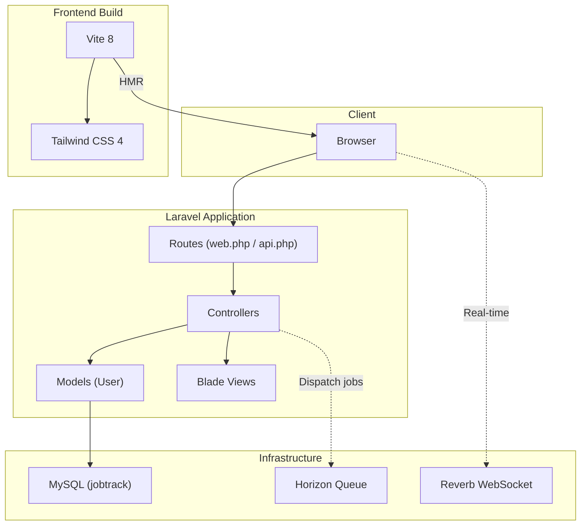

# JobTrack — Project Brief & Setup Guide

---

## 1. Project Brief

### What Is JobTrack?

JobTrack is a real-time job work and subcontract tracking SaaS platform built for the manufacturing industrial belt of Tamil Nadu — specifically targeting Coimbatore, Hosur, and Chennai MSME clusters.

It replaces WhatsApp messages, paper challans, and Excel sheets with a live digital platform that connects principal manufacturers with their subcontractor/job work vendors.

---

### The Problem It Solves

In Coimbatore and Hosur, large factories (TVS, Titan, Ashok Leyland, local pump/motor OEMs) outsource machining, welding, plating, and assembly to hundreds of small job work units. This entire supply chain runs on:

- Paper delivery challans (DC) that get lost
- WhatsApp groups with no accountability
- Phone calls to chase pending batches
- Excel sheets updated at end of day
- No visibility into what is at which vendor, and when it returns

This causes GST compliance issues, material losses, delayed production, and zero real-time visibility.

---

### Who Uses It

| User | Role |
|---|---|
| **Principal (Factory/OEM)** | Creates job orders, sends material, tracks status |
| **Vendor (Job Work Unit)** | Receives material, updates status, dispatches back |
| **Admin (SaaS owner)** | Manages subscriptions, onboarding, billing |

---

### Core Features

#### Principal Dashboard
- Create job work orders (part name, qty, due date, vendor)
- Auto-generate GST-compliant PDF Delivery Challan
- Real-time status board: Material Out → WIP → Ready → Returned
- Delay alerts via WhatsApp/SMS
- Vendor-wise outstanding material report
- Quality rejection tracking

#### Vendor Portal (Mobile-first PWA)
- QR scan to acknowledge material received
- One-tap status update (Received / In Process / Ready / Dispatched)
- Upload photo proof of finished parts
- Works via browser — no app install needed
- Tamil language option

#### Real-time Engine
- WebSocket push — principal sees vendor status update instantly
- WhatsApp bot fallback for vendors without smartphones
- Live map of material across vendor locations

#### Billing & Subscriptions
- Razorpay integration
- Free / Factory / Industrial tiers

---

### Monetization

| Plan | Price | Limits |
|---|---|---|
| Free | ₹0/month | 1 workspace, 50 DCs/month |
| Factory | ₹1,999/month | 1 principal + 20 vendors |
| Industrial | ₹4,999/month | Unlimited + analytics |

---

## 2. Context Constraints (BMAD)

### Business Constraints (B)
- **Monetization & Subscription Tiers**:
  - **Free**: 1 workspace, maximum 50 Delivery Challans (DCs) per month.
  - **Factory**: ₹1,999/month, limited to 1 principal + 20 vendors.
  - **Industrial**: ₹4,999/month, unlimited usage and advanced analytics.
- **Payment Gateway**: Strictly integrated with **Razorpay** for subscription management.
- **Compliance**: Forms and PDFs must comply with local GST rules, specifically tracking material under GST Form ITC-04 requirements.

### Market & User Constraints (M)
- **Geography**: Target audience is the manufacturing clusters of Tamil Nadu (Coimbatore, Hosur, and Chennai MSMEs).
- **Vendor Tech Stack**: Most subcontractors/vendors use low-end smartphones. The vendor interface must be a lightweight, mobile-first PWA.
- **Accessibility & Language**: Tamil language interface is required for vendors to ensure high adoption.
- **Connectivity Fallback**: Provide an automated WhatsApp bot fallback for vendors without internet connectivity or smartphones.

### Architecture & Technical Constraints (A)
- **Framework & Runtime**: Strictly built on **Laravel 13.8** requiring **PHP >= 8.3**.
- **Real-time Event Push**: Must use **Laravel Reverb** for real-time WebSocket state pushes.
- **Queuing & Async Workers**: Queue workers must be run via **Laravel Horizon** (Redis-backed) for SMS/WhatsApp triggers and PDF generation.
- **Local Dev Stack**: Designed to run on **Laragon (Windows)**.
- **API Routing & HTTP Methods**:
  - Do **NOT** use `GET` methods for API endpoints. All API routes must strictly use the **`POST`** method (e.g., both data retrieval and actions).
  - Do **NOT** define route parameters like `{id}` (e.g., no `/api/job-orders/{id}`). Lookups must pass the identifier within the `POST` request body payload and be handled entirely inside the Controller (e.g., `$request->input('id')`).

### Database & Data Constraints (D)
- **Engine**: **MySQL** (database name: `jobtrack`).
- **Cache & Session Drivers**: Currently configured to use `database` storage driver in the environment configuration (`.env`).
- **Material Reconciliation**: Database logs must keep a strict audit trail reconciling parts dispatched vs. parts returned (raw input casting/steel quantity vs. finished parts and scrap/rejected items).

---

## 3. Tech Stack & Architecture

### Technology Stack

| Detail             | Value                          |
|--------------------|--------------------------------|
| **Framework**      | Laravel 13.8                   |
| **PHP Version**    | ≥ 8.3                          |
| **Database**       | MySQL (`jobtrack`)             |
| **Frontend Build** | Vite 8 + Tailwind CSS 4        |
| **Font**           | Instrument Sans (Bunny Fonts)  |
| **Dev Server**     | Laragon (Windows)              |

### Installed Packages

| Package                  | Purpose                                |
|--------------------------|----------------------------------------|
| `laravel/framework` 13.8 | Core framework                        |
| `laravel/sanctum` 4.3    | API token authentication (SPA & mobile)|
| `laravel/passport` 13.7  | OAuth2 server (full OAuth flows)       |
| `laravel/horizon` 5.47   | Redis queue monitoring dashboard       |
| `laravel/reverb` 1.10    | WebSocket server (real-time events)    |
| `tailwindcss` 4.0         | Utility-first CSS framework    |
| `vite` 8.0                | Frontend build tool            |

### System Architecture



---

## 4. Database Schema

### Core Tables

#### `users`
| Column              | Type        | Notes          |
|---------------------|-------------|----------------|
| `id`                | bigint (PK) | Auto-increment |
| `name`              | string      |                |
| `email`             | string      | Unique         |
| `email_verified_at` | timestamp   | Nullable       |
| `password`          | string      | Hashed         |
| `remember_token`    | string      |                |
| `created_at`        | timestamp   |                |
| `updated_at`        | timestamp   |                |

#### `password_reset_tokens`
| Column       | Type        | Notes      |
|--------------|-------------|------------|
| `email`      | string (PK) |           |
| `token`      | string      |            |
| `created_at` | timestamp   | Nullable   |

#### `sessions`
| Column          | Type        | Notes          |
|-----------------|-------------|----------------|
| `id`            | string (PK) |               |
| `user_id`       | bigint (FK) | Nullable, indexed |
| `ip_address`    | string(45)  | Nullable       |
| `user_agent`    | text        | Nullable       |
| `payload`       | longText    |                |
| `last_activity` | integer     | Indexed        |

#### System Tables
- `cache` / `cache_locks`: Database cache driver storage.
- `jobs` / `job_batches` / `failed_jobs`: Database queue storage.
- `personal_access_tokens`: Sanctum token storage.

---

## 5. Directory Structure

```
jobtracker/
├── app/
│   ├── Http/
│   │   └── Controllers/
│   │       └── Controller.php          # Base controller
│   ├── Models/
│   │   └── User.php                    # Only model so far
│   └── Providers/
│       ├── AppServiceProvider.php       # Default bindings
│       └── HorizonServiceProvider.php   # Horizon dashboard config
├── config/                              # Laravel configuration files
├── database/
│   ├── factories/
│   │   └── UserFactory.php             # User model factory
│   ├── migrations/                      # DB migration files
│   └── seeders/
│       └── DatabaseSeeder.php          # Seeds a test user
├── resources/
│   ├── css/
│   │   └── app.css                     # Tailwind v4 entry point
│   ├── js/
│   │   └── app.tsx                     # Frontend JS entry (empty)
│   └── views/
│       └── welcome.blade.php           # Default landing view
├── routes/
│   ├── web.php                         # Web routes (GET /)
│   ├── api.php                         # API routes (empty)
│   └── console.php                     # Console commands
├── vite.config.ts                       # Vite configuration
├── composer.json
└── package.json
```

---

## 6. Setup & Running Guide

### Prerequisites
- PHP ≥ 8.3
- Composer
- Node.js + npm
- MySQL
- Laragon (Windows local server stack)

### Quick Setup

```bash
# Install dependencies
composer install
npm install

# Setup environment configuration
cp .env.example .env
php artisan key:generate

# Configure MySQL credentials in .env, then run migrations:
php artisan migrate

# Seed initial test user (creates test@example.com)
php artisan db:seed
```

### Dev Server Commands

```bash
# Start backend server, Vite HMR, and queue worker together
composer dev

# Or run individually:
php artisan serve          # Serve backend on http://localhost:8000
npm run dev                # Run Vite build with HMR
php artisan queue:listen   # Listen for queued tasks
```

---

## 7. Current Development Status

> [!NOTE]
> This application is at the **early/scaffolding stage**. The Laravel 13 project is initialized with authentication, queues, and assets configured, but the core business logic remains to be written.

### What is Completed ✅
- Laravel 13 framework and standard migrations.
- Sanctum & Passport authentication packages installed.
- Horizon Queue dashboard and Reverb WebSockets integrated.
- Vite 8 + Tailwind CSS 4 build pipeline.
- Database connection to MySQL `jobtrack`.

### What Needs to be Built ⬜
- Custom business models (e.g. `JobOrder`, `DeliveryChallan`, `QualityRejection`, `VendorProfile`).
- Principal Dashboard UI and order creation endpoints.
- Vendor Portal mobile PWA interface.
- GST-compliant Delivery Challan PDF generation.
- Reverb WebSocket broadcast events for real-time tracking updates.
- SMS/WhatsApp notification triggers.
- Razorpay billing subscription portal.
